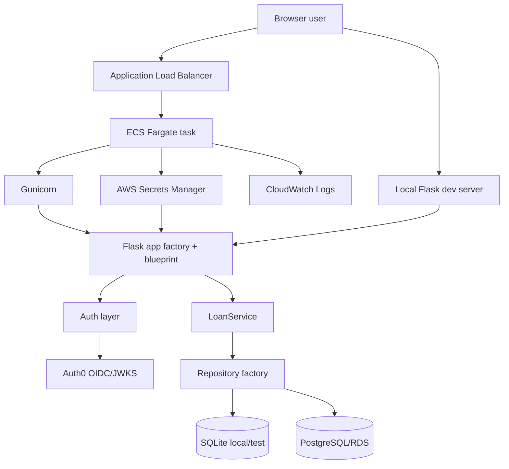
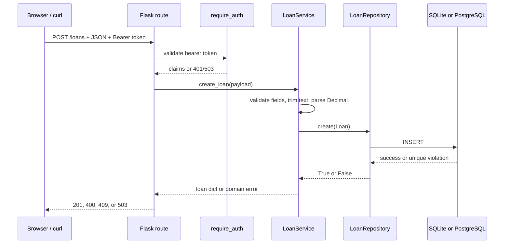
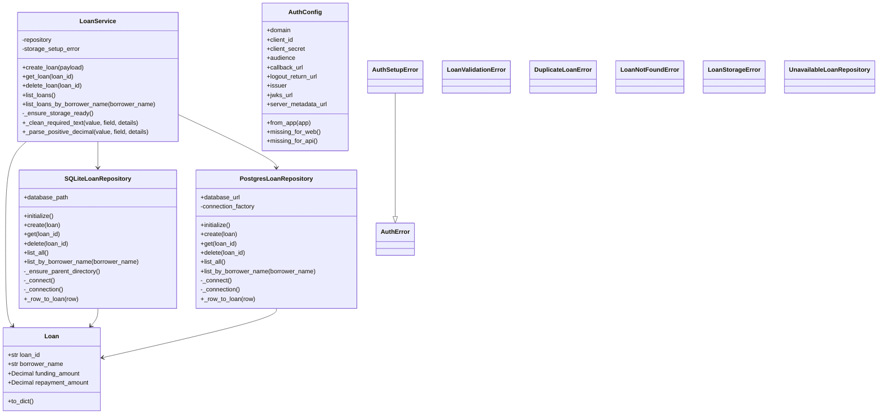
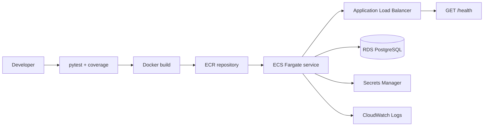
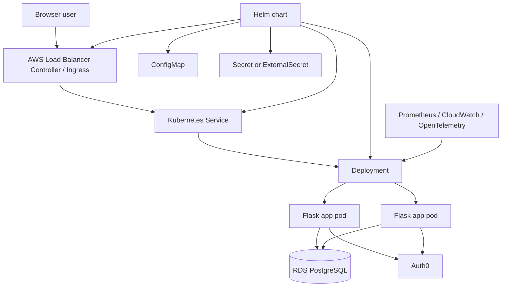

# Interview Prep: Loan Management API and Website

This guide is written to help explain and defend the application in a technical interview. It covers the architecture, modules, classes, functions, dependencies, security decisions, testing strategy, and how the solution could evolve.

## Elevator Pitch

This is a Flask application for managing loan records. It exposes an Auth0-protected JSON API and a small browser website that consumes that API. Business rules live in `LoanService`; persistence is hidden behind repository implementations; and the AWS deployment runs a Docker image on ECS Fargate with PostgreSQL/RDS behind an Application Load Balancer.

The core design goal was to keep the application explainable and testable while still showing a realistic deployment path: local development uses SQLite, deployed runtime uses RDS PostgreSQL, and the same service layer works with both.

## Architecture Diagram



## Main API Flow



## Class Diagram



## AWS Deployment Diagram



## Module Choices

| Module | Role | Why this shape was chosen |
| --- | --- | --- |
| `app/__init__.py` | Flask application factory. | Keeps app creation configurable for local, test, Docker, and AWS runtime. |
| `app/routes.py` | HTTP layer and JSON responses. | Routes translate HTTP concerns into service calls and keep business rules out of controllers. |
| `app/services/loan_service.py` | Business logic and validation. | Centralizes loan workflow rules so they are easy to unit test without Flask or a database server. |
| `app/models/loan.py` | Domain model. | A small immutable dataclass is enough for the current domain and avoids a heavier ORM model. |
| `app/repositories/loan_repository.py` | SQLite repository. | Provides local/test durable storage with only the Python standard library. |
| `app/repositories/postgres_loan_repository.py` | PostgreSQL repository. | Supports AWS RDS without changing the service layer. |
| `app/repositories/repository_factory.py` | Runtime storage selection. | Keeps environment-specific persistence decisions in one place. |
| `app/auth.py` | Auth0 login, session handling, and bearer token validation. | Separates authentication concerns from loan workflow logic. |
| `app/templates/index.html` | Browser UI shell. | Server-rendered HTML keeps the frontend simple for this project. |
| `app/static/loan_website.js` | Browser behavior and API calls. | Vanilla JavaScript is enough for the small UI and avoids a frontend build system. |
| `app/static/loan_website.css` | Responsive styling. | Keeps custom UI styling small and readable, while Bootstrap handles common controls. |
| `infra/aws/bootstrap` | Creates the ECR repository first. | The image repository must exist before the first Docker image can be pushed. |
| `infra/aws/app` | ECS, ALB, RDS, secrets, IAM, network, and logs. | Separates cloud runtime from the initial image registry bootstrap. |
| `tests/` | Unit and integration coverage. | Verifies behavior at the service, repository, auth, HTTP, website, and documentation levels. |

## Library And Dependency Choices

| Dependency | Used for | Reasoning | Interview trade-off |
| --- | --- | --- | --- |
| `Flask` | Web framework, routing, templates, test client. | Small, familiar, fast to explain, and appropriate for a compact API plus website. | Larger applications may want stronger structure or async support, but Flask is pragmatic here. |
| `Authlib` | Auth0 browser login flow. | Handles OAuth/OIDC client behavior instead of implementing redirects and token exchange manually. | Adds dependency and configuration requirements, but avoids custom auth protocol code. |
| `PyJWT[crypto]` | JWT validation against Auth0 JWKS. | Validates bearer tokens with RS256 signature, issuer, and audience checks. | Requires correct Auth0 configuration and JWKS access. |
| `python-dotenv` | Local `.env` loading. | Makes local development easier without committing secrets. | Not a production secret manager. AWS uses Secrets Manager instead. |
| `requests` | HTTP support dependency. | Common HTTP dependency used by auth-related tooling and useful for ecosystem compatibility. | It is not central to the app's own business logic. |
| `gunicorn` | Container runtime WSGI server. | The Flask development server is not the right process manager for ECS. | Adds one runtime component, but it is the standard production WSGI choice. |
| `psycopg[binary]` | PostgreSQL/RDS access. | Modern PostgreSQL driver for Python, works well with parameterized queries and row factories. | Binary package is convenient for a demo; production teams may choose source builds. |
| `pytest` | Test runner. | Simple, expressive, and widely used. | None significant for this scale. |
| `pytest-cov` | Coverage gate. | Enforces the documented minimum coverage target. | Coverage is not a quality guarantee by itself, so tests still need meaningful assertions. |
| `Bootstrap` | UI controls and base styling. | Keeps the website usable without building a design system. | Less custom than a full frontend framework, but faster and simpler. |
| `sqlite3` standard library | Local and test database. | Zero external service needed for local persistence tests. | SQLite is not used as deployed storage. |
| `Docker` | Container packaging. | Gives ECS a repeatable runtime artifact. | Requires image build and push steps. |
| `Terraform` | AWS infrastructure as code. | Repeatable, reviewable deployment for ECR, ECS, ALB, RDS, IAM, secrets, logs, and network. | Local state is fine for demo, but production needs remote state and locking. |

## Backend Files, Classes, And Functions

### `app/__init__.py`

| Item | Responsibility | How to defend it |
| --- | --- | --- |
| `create_app(test_config=None)` | Flask application factory. Loads env config, creates the Flask app, applies test config, selects and initializes the repository, creates `LoanService`, initializes Auth0, and registers the blueprint. | Makes the app easy to configure and test without hard-coded global state. |

### `app/models/loan.py`

| Item | Responsibility | How to defend it |
| --- | --- | --- |
| `Loan` | Immutable dataclass with `loan_id`, `borrower_name`, `funding_amount`, and `repayment_amount`. | The domain model is intentionally small and explicit. It uses `Decimal` internally for money-like values. |
| `Loan.to_dict()` | Converts the domain object to the JSON contract: `loanId`, `borrowerName`, `fundingAmount`, `repaymentAmount`. | Keeps external API naming separate from Python naming. |

### `app/routes.py`

| Item | Responsibility | How to defend it |
| --- | --- | --- |
| `api = Blueprint("api", __name__)` | Groups application routes. | Lets the factory register routes cleanly. |
| `index()` | Renders the main website. | The frontend is server-rendered and simple. |
| `login()` | Starts Auth0 login and displays a recoverable setup error if configuration is incomplete. | Missing local Auth0 config does not crash the whole app. |
| `callback()` | Completes Auth0 login and stores the session. | Keeps OAuth details inside `auth.py`. |
| `logout()` | Clears the session and redirects to Auth0 logout when possible. | Avoids leaving local auth state behind. |
| `auth_status()` | Returns auth state to the browser JavaScript. | The browser UI does not need to understand Flask session internals. |
| `error_response(error, message, status_code, details=None)` | Standardizes JSON error payloads. | Makes API behavior predictable for the frontend and tests. |
| `storage_error_response()` | Returns `503` when storage is unavailable. | Separates infrastructure failure from validation or auth failure. |
| `create_loan()` | `POST /loans`. Checks JSON, calls `LoanService.create_loan`, maps exceptions to `400`, `409`, or `503`. | Thin route: HTTP in the route, business rules in the service. |
| `list_loans()` | `GET /loans`. Lists all loans or filters by `borrowerName`. | One endpoint covers full listing and borrower lookup without duplicate route logic. |
| `get_loan(loan_id)` | `GET /loans/<loan_id>`. Looks up by ID and returns `404` if absent. | Uses `<path:loan_id>` so encoded IDs can be accepted. |
| `delete_loan(loan_id)` | `DELETE /loans/<loan_id>`. Deletes and returns the deleted record. | Returning the deleted object gives clear client feedback. |
| `health()` | `GET /health`. Returns `{"status": "ok"}`. | Public endpoint for ALB/ECS health checks and smoke tests. |

### `app/services/loan_service.py`

| Item | Responsibility | How to defend it |
| --- | --- | --- |
| `ALLOWED_FIELDS` | Defines the accepted create payload fields. | Extra fields are rejected to avoid ambiguous input. |
| `LoanValidationError` | Validation error with field-level details. | Good for both UI feedback and API clients. |
| `DuplicateLoanError` | Signals duplicate loan ID. | Mapped to HTTP `409 Conflict`. |
| `LoanNotFoundError` | Signals missing record for lookup/delete. | Mapped to HTTP `404 Not Found`. |
| `LoanService.__init__()` | Receives the repository and any storage setup error. | Dependency injection keeps tests simple and makes SQLite/Postgres interchangeable. |
| `create_loan(payload)` | Validates type, extra fields, required text, positive amounts, creates a `Loan`, and calls `repository.create`. | Central business rule entry point for create workflow. |
| `get_loan(loan_id)` | Normalizes ID, rejects blank input, looks up the record, returns dict. | Lookup is intentionally exact and case-sensitive. |
| `delete_loan(loan_id)` | Normalizes ID, calls `repository.delete`, returns the removed record or raises not found. | A second delete returns `404`, which is explicit and easy to reason about. |
| `list_loans()` | Lists all current loans. | Ordering and persistence details stay in the repository. |
| `list_loans_by_borrower_name(borrower_name)` | Validates borrower input and delegates exact search. | Simple, deterministic search that satisfies the current requirement. |
| `_ensure_storage_ready()` | Raises `LoanStorageError` if app startup captured a storage setup failure. | Home and health can still work while protected loan workflows fail correctly. |
| `_clean_required_text(value, field, details)` | Accepts only non-empty strings and applies `strip`. | Consistent normalization for ID and borrower name. |
| `_parse_positive_decimal(value, field, details)` | Accepts numeric input, rejects bool, NaN, infinity, and values `<= 0`, then stores as `Decimal`. | Avoids using float as the internal representation. |

### `app/repositories/loan_repository.py`

| Item | Responsibility | How to defend it |
| --- | --- | --- |
| `LoanStorageError` | Common storage/infrastructure error. | Routes do not need to know whether SQLite or Postgres failed. |
| `SQLiteLoanRepository.__init__(database_path)` | Stores the local database path. | SQLite is the simplest local/test fallback. |
| `initialize()` | Creates the parent directory and `loans` table if needed. | Removes manual database setup for local development. |
| `create(loan)` | Inserts a record and returns `False` on duplicate ID. | Converts a unique constraint into domain semantics. |
| `get(loan_id)` | Looks up a record by ID. | Returns `None` for absence instead of raising. |
| `delete(loan_id)` | Reads and deletes the record in a transaction. | Returns the deleted record for API feedback. |
| `list_all()` | Lists records by insertion order. | Stable order makes behavior easy to test. |
| `list_by_borrower_name(borrower_name)` | Exact borrower search ordered by insertion. | Simple and deterministic. |
| `_ensure_parent_directory()` | Ensures the SQLite directory exists. | Reduces local setup friction. |
| `_connect()` | Opens SQLite connection with named row access. | Makes row-to-domain mapping clear. |
| `_connection()` | Context manager that commits and closes connections. | Prevents connection leaks and centralizes transaction handling. |
| `_row_to_loan(row)` | Converts a SQL row to `Loan`. | Keeps persistence mapping out of the service layer. |

### `app/repositories/postgres_loan_repository.py`

| Item | Responsibility | How to defend it |
| --- | --- | --- |
| `PostgresLoanRepository.__init__(database_url, connection_factory=None)` | Receives database URL and optional test connection factory. | Allows repository tests without a real PostgreSQL server. |
| `initialize()` | Creates the PostgreSQL table with `BIGSERIAL` and `UNIQUE loan_id`. | RDS becomes usable on container startup. |
| `create(loan)` | Inserts a row and returns `False` on integrity/duplicate failure. | Keeps the same contract as SQLite. |
| `get(loan_id)` | Looks up by ID using parameterized SQL. | Avoids SQL injection. |
| `delete(loan_id)` | Looks up and removes by ID. | Mirrors SQLite behavior. |
| `list_all()` | Lists records by `sequence ASC`. | Same semantics across storage backends. |
| `list_by_borrower_name(borrower_name)` | Exact borrower search. | Portable behavior across SQLite and Postgres. |
| `_connect()` | Uses `psycopg.connect` with timeout and `dict_row`, or an injected factory. | Real driver in runtime, fake connection in tests. |
| `_connection()` | Context manager that closes connections. | Standardizes connection lifecycle. |
| `_row_to_loan(row)` | Converts dict row to `Loan`. | Keeps SQL mapping outside business logic. |
| `_is_integrity_error(exc)` | Detects exception names like `IntegrityError` and `UniqueViolation`. | Keeps tests independent from concrete psycopg exception classes. |

### `app/repositories/repository_factory.py`

| Item | Responsibility | How to defend it |
| --- | --- | --- |
| `UnavailableLoanRepository` | Placeholder when storage setup fails before a real repository exists. | Lets the app respond with `503` on loan endpoints instead of crashing startup. |
| `UnavailableLoanRepository.initialize()` | No-op. | Exists only as a safe placeholder object. |
| `create_loan_repository(config)` | Chooses Postgres when `LOAN_DATABASE_URL`/`DATABASE_URL` exists, otherwise SQLite, or fails when deployed runtime requires RDS. | Storage selection lives in one place. |
| `_requires_database_url(config)` | Detects `LOAN_REQUIRE_DATABASE_URL` or AWS/ECS environment variables. | Fails closed in deployment so ECS cannot accidentally use ephemeral SQLite. |

### `app/auth.py`

| Item | Responsibility | How to defend it |
| --- | --- | --- |
| `AuthError` | Base auth exception with error code, message, status, and details. | Easy to turn auth failures into JSON responses. |
| `AuthSetupError` | Specific Auth0 configuration error with status `503`. | Separates operational setup problems from invalid credentials. |
| `AuthConfig` | Immutable dataclass with Auth0 configuration. | Groups domain, audience, and derived URLs. |
| `AuthConfig.from_app(app)` | Reads Flask config and normalizes values. | Config can come from env, Terraform, or tests. |
| `issuer` | Returns expected Auth0 issuer. | Used during JWT validation. |
| `jwks_url` | Auth0 public signing keys URL. | Used by PyJWT to verify token signatures. |
| `server_metadata_url` | OIDC discovery URL. | Used by Authlib for browser login. |
| `missing_for_web()` | Lists variables required for browser login. | Web login requires client ID, secret, audience, and callback URL. |
| `missing_for_api()` | Lists variables required for API token validation. | API validation mainly needs domain and audience. |
| `_normalize_domain(value)` | Removes protocol and trailing slash. | Avoids malformed Auth0 URLs. |
| `_truthy(value)` | Converts env string flags to booleans. | Used for cookie security settings. |
| `_setup_message(missing)` | Provides a user-facing setup message. | UI can show a safe error without stack traces. |
| `load_auth_environment()` | Loads `.env` when `python-dotenv` is installed. | Simple local development setup. |
| `init_auth(app)` | Populates Auth0 config, session cookie defaults, testing flag, and Authlib OAuth client. | Centralizes auth initialization. |
| `error_response()` | Creates auth JSON error payloads. | Matches the API error style. |
| `auth_error_response(error)` | Converts `AuthError` into an HTTP response. | Used by the auth decorator. |
| `setup_error_for_missing(missing)` | Creates `AuthSetupError` with per-variable details. | Useful for diagnosing local or AWS setup issues. |
| `has_authenticated_session()` | Checks user/token session and clears expired sessions. | Keeps browser status accurate. |
| `current_auth_status()` | Returns `authenticated`, `user`, `accessToken`, and `setupError`. | Feeds the browser UI. |
| `store_auth_session(user, access_token, expires_at=None)` | Stores user, token, and expiration in the session. | Lets the website call the API after Auth0 login. |
| `clear_auth_session()` | Removes Auth0 session data. | Shared by logout and expired-session handling. |
| `start_login()` | Redirects to Auth0, or a test redirect. | Real login and test flows share the same entry point. |
| `handle_callback()` | Exchanges callback for token, stores session, handles failures. | Isolates OAuth callback details. |
| `handle_logout()` | Clears session and redirects to Auth0 `/v2/logout` when configured. | Keeps local and provider logout aligned. |
| `get_token_auth_header()` | Extracts and validates `Authorization: Bearer <token>`. | Rejects missing, incomplete, or malformed headers. |
| `verify_access_token(token)` | Uses an injected verifier in tests or PyJWT + JWKS in runtime. | Testable without real Auth0 and secure in production-style runtime. |
| `require_auth(view)` | Decorator protecting endpoints and storing claims in `g.auth_claims`. | Keeps authentication out of individual route bodies. |

## Frontend: `app/static/loan_website.js`

| Function/constant | Responsibility |
| --- | --- |
| `loanApiPath` | Base path for loan API calls. |
| `localFeedbackTargetMs` | DOM-exposed target duration for feedback timing. |
| `feedbackClasses` | Maps logical feedback types to Bootstrap classes. |
| `moneyFormatter` | Formats amounts with two decimals. |
| `state` | Stores active action and auth state. |
| `getElement(id)` | Shortcut for `document.getElementById`. |
| `escapeHtml(value)` | Prevents XSS when rendering API data into HTML strings. |
| `showFeedback(type, message, details)` | Updates the global alert. |
| `showFieldErrors(containerId, details)` | Renders field-level validation errors. |
| `setActionControlsDisabled(disabled)` | Disables controls during a running action. |
| `startAction(action, message)` | Prevents concurrent operations and shows loading feedback. |
| `finishAction()` | Clears active action state. |
| `parseResponse(response)` | Reads JSON only when the response content type is JSON. |
| `requestJson(path, options)` | Wraps `fetch`, injects bearer token for `/loans`, maps network/API errors. |
| `errorFeedback(error, fallbackMessage)` | Maps API errors to UI feedback. |
| `signedInLabel(user)` | Builds signed-in text. |
| `resetWorkflowSections()` | Closes workflow panels when signed out. |
| `applyAuthState(authState)` | Applies auth state to the DOM and toggles sections. |
| `loadAuthStatus()` | Calls `/auth/status` on page load. |
| `requireSignedIn()` | Ensures loan workflows only open for authenticated users. |
| `loanMarkup(loan)` | Generates HTML for a loan row. |
| `renderLoanCollection(containerId, loans, emptyMessage)` | Renders a collection or empty state. |
| `renderSingleLoan(containerId, loan)` | Renders one loan. |
| `renderEmptyState(containerId, message)` | Renders an empty state message. |
| `removeLoanFromVisibleResults(loanId)` | Removes deleted loans from visible result panels. |
| `showWorkflowSection(sectionId)` | Opens the selected workflow panel and loads current loans when needed. |
| `loadCurrentLoans({ announceSuccess })` | Calls `GET /loans` and updates list/status. |
| `preserveCreateFormValues()` | Saves create-form values before submit. |
| `restoreCreateFormValues(values)` | Restores values after a failed create. |
| `createPayloadFromForm(form)` | Builds the create JSON payload. |
| `handleCreateLoan(event)` | UI flow for loan creation. |
| `handleBorrowerSearch(event)` | UI flow for `GET /loans?borrowerName=...`. |
| `handleLoanLookup(event)` | UI flow for `GET /loans/<id>`. |
| `handleLoanDelete(event)` | UI flow for `DELETE /loans/<id>`. |
| `bindWebsiteEvents()` | Registers form and button event listeners. |
| `DOMContentLoaded listener` | Initializes events and loads auth status. |

## Security Model

### What is already considered

| Area | Current approach | Why it matters |
| --- | --- | --- |
| Authentication | Loan endpoints use `@require_auth` and require a valid Auth0 bearer token. | Unauthenticated users cannot create, list, search, look up, or delete loans. |
| JWT validation | Tokens are verified with PyJWT, Auth0 JWKS, expected issuer, expected audience, and RS256. | Prevents accepting unsigned, wrongly issued, or wrong-audience tokens. |
| Auth setup failure | Missing Auth0 API config produces an auth setup error instead of silently allowing access. | Protected workflows fail closed. |
| Session handling | Session cookies are `HttpOnly`, `SameSite=Lax`, and can be `Secure` in HTTPS environments. | Reduces common cookie exposure and CSRF risk. |
| Secrets | AWS runtime injects database URL, Auth0 client secret, and Flask secret via Secrets Manager. | Secrets are not committed to git or stored in plain Terraform variables in the app code. |
| Database access | RDS is not publicly accessible; its security group accepts PostgreSQL only from the ECS security group. | The database is not open to the internet. |
| SQL injection | SQLite and Postgres queries use parameterized SQL. | User input is not interpolated into SQL strings. |
| Input validation | `LoanService` rejects unknown fields, blank strings, non-positive amounts, booleans, NaN, and infinity. | Reduces invalid or ambiguous data entering storage. |
| Duplicate handling | `loan_id` is unique in the database and duplicate create returns `409`. | The database enforces uniqueness, not just application code. |
| XSS reduction | The frontend uses `escapeHtml` before injecting API values into HTML. | Prevents stored loan values from becoming executable markup. |
| Storage safety in ECS | `LOAN_REQUIRE_DATABASE_URL=true` prevents deployed runtime from falling back to SQLite. | Avoids accidental use of ephemeral container storage. |
| Health check | `/health` is public but returns only `{"status":"ok"}`. | Safe for ALB health checks because it exposes no sensitive data. |
| IAM | ECS task execution role reads only the required Secrets Manager secrets. | Keeps runtime permissions narrow for the demo. |
| Logs | Application logs go to CloudWatch. | Gives operators a place to debug ECS failures. |

### Known security limitations for a demo

| Limitation | Production direction |
| --- | --- |
| The demo ALB uses HTTP. | Add ACM certificate, HTTPS listener on `443`, HTTP-to-HTTPS redirect, and Auth0 HTTPS callback/logout URLs. |
| The browser receives the access token through `/auth/status`. | For production, prefer a backend-for-frontend pattern where the server keeps tokens out of JavaScript and proxies API calls using an `HttpOnly` session. |
| No explicit CSRF token on state-changing browser actions. | If using cookie-authenticated browser actions, add CSRF protection. With bearer-only API calls, keep CORS restricted and avoid cookie-based API auth. |
| No rate limiting. | Add rate limiting at ALB/API layer or application middleware. |
| No authorization ownership model. | Add tenant/user ownership fields and enforce per-user or per-organization access checks. |
| No WAF. | Add AWS WAF for internet-facing production traffic if needed. |
| No audit trail. | Add structured audit events for create/delete actions. |
| Terraform uses local state. | Use remote state in S3 with locking, and protect sensitive state access. |

## Observability And Monitoring

For the current ECS/RDS design, observability would be built around the three classic signals: logs, metrics, and traces. The goal is not just to know whether the container is running, but to know whether users can successfully complete the loan workflows within the expected latency.

### What we would monitor

| Area | Signal | Why |
| --- | --- | --- |
| Availability | ALB target health, ECS service desired vs running tasks, `/health` status. | Confirms the service is reachable and the scheduler has healthy tasks. |
| Latency | ALB target response time, application request duration by route. | Detects slow create/list/search/delete workflows. |
| Error rate | HTTP `5xx`, application exceptions, storage `503` responses, Auth0 validation failures. | Separates app errors, auth errors, and infrastructure problems. |
| Traffic | Requests per route, concurrent users, ALB request count. | Helps understand load and capacity. |
| Database health | RDS CPU, connections, storage, IOPS, deadlocks, query latency. | Most user-facing workflows depend on the database. |
| ECS health | CPU, memory, restarts, task deployment failures, container exit codes. | Shows whether Fargate tasks are under-sized or unstable. |
| Auth health | Login/callback failures, token validation failures, missing config errors. | Auth issues can look like app downtime from the user perspective. |
| Business flow | Loan creates, duplicates, deletes, not-found lookups, validation failures. | Gives product-level visibility, not just infrastructure health. |

### Logging approach

The next improvement would be structured JSON logs. Each request should include a request ID, route, method, status code, latency, authenticated subject or tenant ID when available, and error category. Create/delete workflows should emit audit-style events with actor, action, loan ID, and result, while never logging secrets, bearer tokens, database URLs, or Auth0 client secrets.

In AWS, these logs would go to CloudWatch Logs. We could add CloudWatch metric filters for high-value events such as `loan_storage_unavailable`, unhandled exceptions, and repeated auth failures. For production, a log aggregation tool such as OpenSearch, Datadog, New Relic, or Grafana Loki could make querying and alerting easier.

### Metrics approach

For the ECS version, the simplest path is CloudWatch metrics from ALB, ECS, and RDS plus custom app metrics. The custom metrics would include request duration by endpoint, request count by status code, storage error count, and business operation counts. If we wanted a more portable setup, we could expose Prometheus-style metrics from Flask and scrape them with a managed or self-hosted Prometheus stack.

Useful alert examples:

| Alert | Example threshold | Meaning |
| --- | --- | --- |
| High 5xx rate | `5xx > 1% for 5 minutes` | Users are seeing server-side failures. |
| Storage unavailable | Any sustained `loan_storage_unavailable` errors. | RDS config/connectivity may be broken. |
| High latency | p95 request latency above 2 seconds for 5 minutes. | Violates the demo performance target. |
| No healthy ALB targets | Healthy host count is zero. | Service is effectively down. |
| ECS task churn | Frequent task restarts or failed deployments. | Container is crashing or health checks are failing. |
| RDS pressure | High CPU/connections/storage or low free storage. | Database is becoming the bottleneck. |

### Tracing approach

Distributed tracing would be valuable once the app has more dependencies. With OpenTelemetry, each request could be traced across Flask route handling, Auth0/JWKS calls, service logic, and database queries. In AWS, traces could be sent to AWS X-Ray or another OpenTelemetry-compatible backend. Traces would help answer: "Is the time spent in the app, authentication, the database, or the network?"

## SRE Foundations

The SRE mindset is to define reliability in user terms, measure it, and use that measurement to make engineering trade-offs.

| Concept | How it applies here |
| --- | --- |
| SLI | A measurable user-facing reliability signal. For this app: successful protected loan requests, p95 latency, and successful health checks. |
| SLO | A target for an SLI. Example: 99.5% of loan API requests should succeed over 30 days, and p95 latency should stay under 2 seconds. |
| Error budget | The acceptable amount of unreliability. If the SLO is being burned too fast, prioritize reliability work over feature work. |
| Alerting | Alerts should map to user impact, not every noisy internal event. Page on symptoms, ticket on causes. |
| Incident response | Have a runbook for service down, RDS unavailable, Auth0 misconfigured, failed deployment, and rollback. |
| Postmortems | Blameless review of incidents: what happened, impact, detection gap, root cause, and prevention actions. |
| Toil reduction | Automate repeated manual work such as deploy verification, smoke tests, rollback, and environment setup. |
| Capacity planning | Watch traffic, latency, CPU/memory, DB connections, and RDS storage trends before they become outages. |
| Change management | CI tests, image tags, Terraform plans, staged deploys, health checks, and rollback reduce deployment risk. |

For this project, a pragmatic SRE maturity path would be:

1. Define SLIs/SLOs for API success rate and latency.
2. Add structured logs and dashboards for ALB/ECS/RDS/app metrics.
3. Add alerts only for user-impacting symptoms.
4. Add a deployment runbook and rollback runbook.
5. Add smoke tests after every deploy.
6. Add incident templates and postmortem actions.
7. Use error budget status to decide whether to ship features or invest in reliability.

## If We Had Used EKS And Helm

EKS and Helm would be a valid alternative, but it would add operational complexity that is not necessary for this small demo. The current ECS/Fargate design is simpler to explain: one container service, one load balancer, one RDS database, and AWS-managed scheduling. EKS would make more sense if the team already runs Kubernetes, needs Kubernetes-native tooling, has multiple services, or wants portability across cloud providers.

### EKS architecture alternative



### Kubernetes objects we would use

| Object | Purpose |
| --- | --- |
| `Deployment` | Runs the Flask/Gunicorn container replicas and manages rolling updates. |
| `Service` | Provides a stable internal endpoint for the pods. |
| `Ingress` | Exposes the service through an AWS load balancer. |
| `ConfigMap` | Stores non-secret config such as Auth0 domain, audience, callback URL, and feature flags. |
| `Secret` or `ExternalSecret` | Stores or references sensitive values such as database URL, Auth0 client secret, and Flask secret. |
| `ServiceAccount` | Gives pods scoped AWS permissions through IAM Roles for Service Accounts if needed. |
| `HorizontalPodAutoscaler` | Scales pods based on CPU, memory, or custom metrics. |
| `PodDisruptionBudget` | Keeps minimum availability during node maintenance or voluntary disruptions. |
| `NetworkPolicy` | Restricts pod-to-pod or pod-to-external traffic where supported. |
| `Job` or migration hook | Runs schema migrations before rollout if migrations are introduced. |

### Helm chart structure

```text
charts/yl-loans/
├── Chart.yaml
├── values.yaml
├── values-demo.yaml
├── values-prod.yaml
└── templates/
    ├── deployment.yaml
    ├── service.yaml
    ├── ingress.yaml
    ├── configmap.yaml
    ├── secret.yaml
    ├── serviceaccount.yaml
    ├── hpa.yaml
    ├── pdb.yaml
    └── NOTES.txt
```

Important Helm values would include:

```yaml
image:
  repository: "<account>.dkr.ecr.eu-west-2.amazonaws.com/yl-loans-demo-app"
  tag: "<git-sha>"

replicaCount: 2

env:
  auth0Domain: "tenant.auth0.com"
  auth0Audience: "https://loan-api"
  loanRequireDatabaseUrl: "true"

secrets:
  databaseUrl: "..."
  auth0ClientSecret: "..."
  appSecretKey: "..."

ingress:
  enabled: true
  host: "loans.example.com"
  tls: true

resources:
  requests:
    cpu: 100m
    memory: 256Mi
  limits:
    cpu: 500m
    memory: 512Mi
```

### EKS deployment flow

1. Build and push the Docker image to ECR.
2. Update the Helm image tag to the Git SHA or release version.
3. Run `helm lint` and template validation.
4. Deploy with `helm upgrade --install`.
5. Kubernetes performs a rolling update on the `Deployment`.
6. Readiness probes keep bad pods out of traffic.
7. Liveness probes restart stuck pods.
8. Smoke tests call `/health` and protected loan workflows.
9. Rollback uses `helm rollback` to a previous release revision.

### EKS observability

In EKS, observability would normally use Kubernetes-native tooling:

| Tooling | Purpose |
| --- | --- |
| Prometheus | Scrape pod, service, ingress, and app metrics. |
| Grafana | Dashboards for Kubernetes, app, ALB, and RDS metrics. |
| Alertmanager | Alert routing based on SLOs and service ownership. |
| Fluent Bit or OpenTelemetry Collector | Collect logs from pods and ship them to CloudWatch, OpenSearch, Loki, or another backend. |
| OpenTelemetry | App traces and metrics with vendor-neutral instrumentation. |
| AWS Load Balancer Controller metrics | Ingress/ALB health and request metrics. |

### ECS vs EKS trade-off

| Topic | ECS/Fargate current design | EKS + Helm alternative |
| --- | --- | --- |
| Operational complexity | Lower. AWS manages most of the orchestration surface. | Higher. Requires Kubernetes cluster, add-ons, upgrades, RBAC, and chart management. |
| Interview explainability | Easier for a small app. | More impressive if Kubernetes is expected, but harder to justify for this scope. |
| Portability | AWS-specific. | More portable across Kubernetes platforms. |
| Deployment packaging | Terraform task definition and ECS service. | Helm chart with Kubernetes manifests. |
| Scaling | ECS desired count/autoscaling. | HPA, cluster autoscaler/Karpenter, deployments. |
| Observability | CloudWatch-first, optional OpenTelemetry. | Prometheus/Grafana/OpenTelemetry are common. |
| Secret management | Secrets Manager injected into ECS task. | Kubernetes Secret, External Secrets Operator, or Secrets Store CSI Driver. |
| Rollback | Update ECS service to previous image URI/task definition. | `helm rollback` to previous release. |
| Best fit | Small AWS-native service. | Teams already standardized on Kubernetes or running many services. |

## Testing Strategy

Main command:

```bash
pytest --cov=app --cov-report=term-missing --cov-fail-under=80
```

Current verified result after updating this guide:

```text
128 passed
Total coverage: 86.89%
Required coverage: 80%
```

### Current coverage by layer

| Layer | Files | What it proves |
| --- | --- | --- |
| Unit - service | `tests/unit/test_loan_service.py` | Validation, normalization, duplicate handling, lookup, delete, listing, and borrower filtering without HTTP. |
| Unit - SQLite repo | `tests/unit/test_loan_repository.py` | Schema creation, persistence across repository instances, duplicate handling, and delete behavior. |
| Unit - Postgres repo | `tests/unit/test_postgres_loan_repository.py` | PostgreSQL SQL behavior and repository contract using fake connections instead of real RDS. |
| Unit - factory | `tests/unit/test_repository_factory.py` | SQLite/Postgres selection and fail-closed behavior when database URL is required. |
| Unit - auth | `tests/unit/test_auth.py` | Auth0 config, sessions, bearer header parsing, injected verifier, JWKS failures, and cookie settings. |
| Integration - API | `tests/integration/test_*_api.py` | HTTP contracts for create, list, search, get, delete, health, and protected auth behavior. |
| Integration - durability | `tests/integration/test_durable_loan_persistence.py` | Data survives new app instances and storage failures become `503` responses. |
| Integration - website | `tests/integration/test_loan_website.py` | HTML, JS, and CSS expose expected panels, states, and hooks. |
| Documentation tests | `tests/integration/test_documentation_examples.py` | README and Speckit contracts stay aligned with project behavior. |

### How we would expand testing

| Area | Additional tests |
| --- | --- |
| Real PostgreSQL integration | Add a Docker Compose or Testcontainers PostgreSQL test job to validate `psycopg` behavior against a real database. |
| Browser E2E | Use Playwright to run sign-in mock, create/list/search/get/delete flows through the actual UI. |
| Security tests | Add tests for CORS policy, CSRF decisions if introduced, secure cookie settings in HTTPS config, and auth failure paths. |
| Infrastructure validation | Run `terraform fmt`, `terraform validate`, and possibly policy checks such as Checkov or tfsec in CI. |
| Container validation | Build Docker image in CI, run it locally, call `/health`, and run a smoke workflow against the container. |
| Contract tests | Keep OpenAPI examples and README commands executable through tests. |
| Load/performance smoke | Add a small k6/Locust or scripted smoke test for demo-scale response time under concurrent reads/writes. |
| Migration tests | Once migrations exist, test upgrade from an old schema to the current schema. |
| Observability tests | Verify structured logs for create/delete/error flows do not leak secrets. |

## Architecture Decisions

| Decision | Reason | Trade-off |
| --- | --- | --- |
| Flask application factory | Easy to configure for tests, local runs, Docker, and AWS. | Slightly more indirect than a single global app object. |
| Single blueprint | The app is small and endpoints are cohesive. | A larger app would split auth, API, and admin routes. |
| Service layer | Business rules are isolated from HTTP and SQL. | Adds one layer, but improves testability. |
| Repository pattern | SQLite and RDS/Postgres share the same service contract. | No formal ABC; the contract is enforced by tests and convention. |
| SQLite local, Postgres in AWS | Local setup is simple while deployed data is durable. | Two backends require tests to keep behavior consistent. |
| Decimal internally | Avoids float precision issues inside business logic. | API currently returns numeric JSON floats for simplicity. |
| Auth0 with Authlib and PyJWT | Uses standard OAuth/OIDC login and JWT validation. | Requires correct Auth0 tenant, audience, and callback setup. |
| Fail-closed deployed storage | ECS requires `DATABASE_URL`. | Misconfigured ECS loan endpoints return `503` instead of using temporary storage. |
| Docker and Gunicorn | Appropriate WSGI runtime for ECS. | Requires image build/push workflow. |
| Terraform split into `bootstrap` and `app` | ECR repository must exist before first image push. | Two Terraform applies instead of one. |
| HTTP-only ALB for demo | Keeps the cloud demo small and explainable. | Production needs HTTPS before real users or data. |
| Vanilla JS frontend | No frontend build chain required. | A larger UI may benefit from a framework and component tests. |

## How To Explain It In 5 Minutes

1. "The app has three main layers: Flask routes, `LoanService`, and repositories."
2. "Auth0 protects loan endpoints with bearer tokens; `/health` is public for the load balancer."
3. "The service validates payloads, normalizes strings, uses Decimal internally, and maps duplicate/not-found cases to domain exceptions."
4. "The repository factory chooses SQLite for local/test or Postgres when `DATABASE_URL` exists."
5. "In ECS, `LOAN_REQUIRE_DATABASE_URL=true` makes the app fail closed if RDS is not configured."
6. "AWS uses ECR for the image, ECS Fargate for compute, ALB for traffic, RDS for persistence, Secrets Manager for secrets, and CloudWatch for logs."
7. "Tests cover service, repositories, auth, HTTP contracts, website behavior hooks, documentation, and durable persistence."

## Likely Interview Questions

**Why not put validation in the routes?**  
Routes should translate HTTP. Domain validation in `LoanService` is reusable and testable without Flask.

**Why use a repository pattern?**  
The requirement needs simple local storage and RDS-backed deployed storage. A repository contract lets the same service layer work with both.

**How do you ensure ECS does not accidentally use ephemeral SQLite?**  
Terraform sets `LOAN_REQUIRE_DATABASE_URL=true`. The factory detects that flag or AWS/ECS environment markers and raises `LoanStorageError` if no database URL exists.

**How is duplicate create handled?**  
The database enforces `UNIQUE loan_id`. The repository converts unique violations into `False`, the service raises `DuplicateLoanError`, and the route returns `409 Conflict`.

**How is not-found handled?**  
The repository returns `None`, the service raises `LoanNotFoundError`, and the route returns `404`.

**How is Auth0 tested without real Auth0?**  
Tests inject `AUTH_TOKEN_VERIFIER`, so `verify_access_token` uses a deterministic test verifier instead of calling real JWKS.

**Why no ORM?**  
The data model is tiny and the SQL is straightforward. Direct parameterized SQL keeps the storage behavior transparent for this challenge.

**What would you change for production?**  
Add HTTPS, remote Terraform state, real migrations, CI/CD, backups, audit logs, rate limiting, tenant-level authorization, production observability, and a safer browser token pattern.

## Evolution Plan

| Next step | Why | How |
| --- | --- | --- |
| Add HTTPS | Required before real users/data. | ACM certificate, `443` ALB listener, redirect `80` to `443`, update Auth0 URLs, set secure cookies. |
| Add CI/CD | Make deploy repeatable and safer. | GitHub Actions: install deps, run tests/coverage, build image, push to ECR, run Terraform with approval. |
| Add remote Terraform state | Avoid local-state drift and support team workflows. | S3 backend with DynamoDB locking and restricted IAM access. |
| Add schema migrations | Avoid implicit startup schema changes. | Alembic or a small migration runner with tested upgrade paths. |
| Add pagination | Protect list endpoint as data grows. | `limit`/`offset` or cursor pagination plus tests. |
| Add ownership/tenancy | Prevent all authenticated users from sharing all records. | Store `owner_id` or `tenant_id` from JWT claims and filter all repository operations. |
| Return money as strings | Preserve exact decimal API representation. | Change contract to return `"1000.00"` style strings and update tests/docs. |
| Add audit logging | Trace sensitive create/delete operations. | Structured logs/events with actor, action, record ID, and timestamp, without secrets. |
| Add observability | Faster production diagnosis. | Structured JSON logs, request IDs, metrics, dashboards, and alarms. |
| Add backup/restore plan | Protect RDS data. | Automated backups, retention policy, restore runbook, and restore drill tests. |
| Improve frontend auth | Reduce token exposure in browser JS. | Backend-for-frontend pattern with server-held tokens and `HttpOnly` session cookie. |

## Roadmap Of Evolutions

This roadmap assumes the application starts as a technical-demo service and evolves toward a production-grade internal platform.

### Phase 1: Hardening the current demo

| Workstream | What we would do | Why |
| --- | --- | --- |
| HTTPS | Add ACM certificate, HTTPS ALB listener, HTTP redirect, secure cookies, and HTTPS Auth0 URLs. | Required before any real user or real data. |
| CI checks | Run pytest, coverage, Docker build, and Terraform validation on every pull request. | Catch regressions before deployment. |
| Structured logs | Add JSON logs with request ID, route, status, latency, and error category. | Makes incidents diagnosable. |
| Smoke tests | Automate `/health` plus authenticated create/list/search/get/delete after deploy. | Verifies real user workflows, not just container health. |
| Runtime config validation | Fail startup or expose clear `503` errors when required env vars are missing. | Avoids partially broken deployments. |

### Phase 2: Operational readiness

| Workstream | What we would do | Why |
| --- | --- | --- |
| Dashboards | Build dashboards for ALB, ECS, RDS, app errors, auth failures, and business operations. | Gives the team one place to assess health. |
| Alerting | Add SLO-based alerts for high error rate, high latency, no healthy targets, RDS pressure, and task churn. | Alerts on user impact instead of noise. |
| Runbooks | Document storage outage, Auth0 misconfiguration, failed deploy, rollback, and RDS restore. | Reduces time to recover during incidents. |
| Backups | Enable RDS automated backups and periodically test restore. | Backup only matters if restore works. |
| Remote Terraform state | Move state to S3 with DynamoDB locking and restricted IAM. | Makes infrastructure changes safe for teams and CI. |

### Phase 3: Product and data model growth

| Workstream | What we would do | Why |
| --- | --- | --- |
| Ownership model | Add `owner_id` or `tenant_id` from JWT claims and filter all operations by owner/tenant. | Prevents every authenticated user from seeing every loan. |
| Pagination | Add `limit`, cursor/offset, stable sort order, and tests. | Prevents list endpoints from degrading as data grows. |
| Search improvements | Add case-insensitive or partial borrower search with indexes. | Makes lookup more useful at scale. |
| Audit history | Store immutable create/delete/update audit events. | Required for traceability and compliance-style reviews. |
| Decimal contract | Return monetary values as strings instead of floats. | Preserves exact financial representation over the API. |

### Phase 4: Scale and resilience

| Workstream | What we would do | Why |
| --- | --- | --- |
| Horizontal scaling | Increase ECS desired count and add autoscaling on CPU, memory, request count, or latency. | Handles higher traffic and improves availability. |
| Database scaling | Add indexes, tune connection limits, introduce pooling, and consider RDS read replicas for read-heavy traffic. | Prevents RDS from becoming the bottleneck. |
| Zero-downtime migrations | Add versioned migrations and backwards-compatible rollout patterns. | Avoids breaking old and new app versions during deploy. |
| Multi-AZ readiness | Use production RDS Multi-AZ, multiple ECS tasks across AZs, and proper subnet design. | Reduces impact of an AZ failure. |
| Disaster recovery | Define RPO/RTO, backup retention, restore steps, and periodic restore drills. | Makes recovery measurable and rehearsed. |

## Test Scenario Roadmap

The test strategy should grow from unit/integration coverage into deployment, resilience, and production-readiness tests.

### Functional scenarios

| Scenario | What to verify | Why |
| --- | --- | --- |
| Create loan success | Valid payload returns `201` and persisted body. | Core workflow. |
| Validation failure | Missing/blank fields, extra fields, non-positive amounts, booleans, NaN/infinity are rejected. | Protects data quality. |
| Duplicate ID | Duplicate `loanId` returns `409` and does not overwrite existing data. | Protects uniqueness. |
| List loans | Returns only current records in stable insertion order. | Main read workflow. |
| Borrower search | Exact borrower search returns matching current records. | Search contract. |
| Lookup by ID | Existing ID returns `200`; unknown/blank ID returns `404`. | Detail contract. |
| Delete loan | Existing ID returns deleted record and removes it from list/search/lookup. | Destructive workflow. |
| Delete twice | Second delete returns `404` and does not affect other records. | Idempotency expectation is explicit. |

### Auth and security scenarios

| Scenario | What to verify | Why |
| --- | --- | --- |
| Missing bearer token | Protected loan endpoints return `401`. | Access control. |
| Malformed bearer token | Invalid auth header returns `401`. | Header validation. |
| Wrong audience/issuer | Token validation rejects wrong Auth0 audience or issuer. | Prevents accepting tokens from the wrong API or tenant. |
| Expired session | Browser session is cleared and UI shows signed-out state. | Avoids stale access. |
| Missing Auth0 config | Protected API fails closed with setup error. | Prevents accidental open access. |
| XSS input | Borrower/loan values containing markup render escaped in the UI. | Prevents stored XSS. |
| SQL injection strings | User-controlled strings are treated as values, not SQL. | Validates parameterized queries. |

### Persistence and deployment scenarios

| Scenario | What to verify | Why |
| --- | --- | --- |
| App restart | Created loan survives new app instance. | Proves durable storage. |
| ECS task replacement | Loan survives forced new ECS deployment. | Proves RDS-backed deployment. |
| Missing `DATABASE_URL` in ECS | Loan endpoints return storage unavailable instead of using SQLite. | Prevents ephemeral data loss. |
| RDS unavailable | API returns controlled `503`, app does not expose secrets, health behavior is understood. | Graceful degradation. |
| Docker smoke | Container starts, `/health` returns `200`, and workflows work with configured env. | Validates packaged runtime. |
| Terraform validation | Terraform formats and validates before apply. | Avoids bad infrastructure changes. |

### Non-functional scenarios

| Scenario | What to verify | Why |
| --- | --- | --- |
| Latency | p95 for key endpoints remains under target, for example 2 seconds. | User experience and SLO. |
| Load | App handles expected concurrent users and loan volume. | Capacity confidence. |
| Spike traffic | Autoscaling or capacity buffer handles short request bursts. | Resilience to traffic changes. |
| Long list | Listing remains bounded through pagination once added. | Prevents memory/latency issues. |
| Log safety | Logs do not contain bearer tokens, database URLs, client secrets, or app secret key. | Secret protection. |
| Restore drill | Restore RDS backup into a test environment and verify data. | Backup confidence. |

## Failure Modes And Mitigations

| What can go wrong | Impact | How to detect | How to prevent or mitigate |
| --- | --- | --- | --- |
| Auth0 configuration is wrong | Login or token validation fails. | Auth failure logs, `/auth/status` setup error, elevated `401/503`. | Validate required env vars, document Auth0 URLs, add smoke tests after deploy. |
| Auth0 is temporarily unavailable | Users cannot sign in or token validation may fail on JWKS lookup. | Login/callback errors, token validation errors. | Cache JWKS where appropriate, alert on auth failures, communicate external dependency outage. |
| RDS is unreachable | Loan endpoints fail. | `loan_storage_unavailable`, RDS metrics, connection errors. | Security group tests, RDS alarms, retries with care, controlled `503`, runbook. |
| RDS runs out of connections | Requests fail or slow down. | RDS connection count, app storage errors, latency increase. | Connection pooling, right-size DB, tune Gunicorn workers, autoscale carefully. |
| RDS storage fills up | Writes fail and app becomes unreliable. | Free storage alarms. | Storage autoscaling, alerts, retention policies, cleanup/archive plan. |
| ECS task crashes | Service loses capacity. | ECS task restart events, ALB unhealthy targets. | Health checks, logs, memory/CPU limits, deployment rollback. |
| Bad image deployed | New version breaks workflows. | Smoke tests fail, error rate increases. | Immutable image tags, staged deploy, health checks, quick rollback to previous image. |
| Terraform applies wrong config | Infrastructure outage or drift. | Terraform plan review, deployment failure, AWS alarms. | Remote state, code review, plan approvals, least-privilege CI role. |
| SQLite used in deployed runtime | Data is lost on task restart. | Missing RDS persistence after task replacement. | `LOAN_REQUIRE_DATABASE_URL=true`, deployment smoke test with forced task replacement. |
| No pagination as data grows | Slow list endpoints and memory pressure. | p95 latency, memory usage, large response sizes. | Add pagination, indexes, response limits. |
| All users share all loans | Data exposure between users/tenants. | Security review, tests showing cross-user access. | Add tenant/user ownership and enforce it in service/repository queries. |
| Secrets leak in logs or state | Credential exposure. | Secret scanning, log review. | Never log secrets, use Secrets Manager, restrict Terraform state access, run secret scanners. |
| ALB uses HTTP in production | Traffic can be intercepted or modified. | Security review. | Add HTTPS before production use. |
| Insufficient observability | Incidents take longer to diagnose. | Long MTTR, unclear alerts. | Structured logs, dashboards, tracing, runbooks, SLO-based alerts. |

## Scaling Strategy

Scaling should be driven by measured bottlenecks rather than assumptions.

### Application scaling

For ECS, the first step is to run more than one task across multiple Availability Zones. Then add ECS Service Auto Scaling using CPU, memory, ALB request count per target, or custom latency metrics. Gunicorn worker count should be tuned to the CPU/memory allocated to each task, and load tests should validate the setting.

Key guardrail: do not scale application tasks without checking database connection limits. More tasks can create more concurrent DB connections and move the bottleneck to RDS.

### Database scaling

The first database improvements would be indexes on query paths, especially `loan_id` and borrower lookup. `loan_id` is already unique; borrower search may need an index once data grows. If reads dominate, consider a read replica for read-only list/search workloads. If connections become the bottleneck, add connection pooling or reduce per-task concurrency.

For larger production systems, we would also define archiving/retention rules, add migrations, monitor slow queries, and rehearse restore from backup.

### Resilience patterns

| Pattern | How it helps |
| --- | --- |
| Multiple ECS tasks | Keeps service available if one task crashes. |
| Multi-AZ placement | Reduces impact of one Availability Zone issue. |
| ALB health checks | Removes unhealthy tasks from traffic. |
| Readiness-style startup behavior | Prevents traffic before the app is actually ready. |
| Controlled timeouts | Avoids requests hanging indefinitely on database/auth calls. |
| Backward-compatible migrations | Lets old and new app versions overlap during deployment. |
| Rollback runbook | Reduces recovery time after a bad deploy. |
| Backup/restore drills | Validates disaster recovery instead of assuming it works. |

## Operational Runbooks

### If loan endpoints return `503`

1. Check whether `/health` is still `200`.
2. Check CloudWatch logs for `loan_storage_unavailable`.
3. Confirm ECS task has `DATABASE_URL` secret injected.
4. Confirm RDS is available and security groups allow ECS to RDS on `5432`.
5. Check RDS connections, CPU, storage, and recent events.
6. If caused by a new deploy, roll back to the previous image.
7. After recovery, add or update a smoke test if the issue was preventable.

### If login works but API calls return `401`

1. Confirm the browser or client sends `Authorization: Bearer <token>`.
2. Check `AUTH0_AUDIENCE` matches the Auth0 API identifier.
3. Check `AUTH0_DOMAIN` and issuer are correct.
4. Check token expiration and scopes/claims if authorization is expanded.
5. Review recent Auth0 configuration changes.

### If a deployment fails

1. Check ECS service events and task logs.
2. Confirm the image URI exists in ECR.
3. Confirm required secrets exist and the task execution role can read them.
4. Confirm ALB target group health check path is `/health`.
5. Roll back to the last known-good image URI or task definition.
6. Run smoke tests and record the root cause.

## Risks And Future Improvements

- The API returns money amounts as JSON numbers; production finance APIs often return decimal strings.
- Schema creation happens at startup; production should use versioned migrations.
- Borrower search is exact; production may need case-insensitive search, partial search, indexes, or normalized names.
- There is no pagination yet; demo-scale is fine, but production lists need limits.
- The demo ALB uses HTTP; production needs HTTPS.
- Terraform state is local; team or CI usage needs remote state and locking.
- The current authorization model is "any authenticated user can access current loans"; production needs ownership or tenant boundaries.
- The browser-visible access token is acceptable for a demo but should be improved for production.

## Prompt Pack To Recreate This Solution

These are the separated prompts that could be used to recreate the solution in the same style: clear responsibility boundaries, local SQLite, AWS ECS/RDS deployment, Auth0, website, tests, documentation, and operational thinking.

### Prompt 1: Repository rules, constitution, and skills

```text
Read AGENTS.md and specs/011-aws-ecs-rds-deploy/plan.md before coding. If a Speckit constitution file exists, follow it; otherwise apply these constraints: keep the solution explainable under 40 minutes, use Python + Flask + Bootstrap, keep pytest coverage >=80%, avoid unnecessary frameworks, no secrets in git, local SQLite for development/tests, PostgreSQL/RDS for AWS runtime, Docker + ECS Fargate + ECR for deployment. Use repository instructions and local skills only when relevant. Do not commit or push unless explicitly asked.
```

### Prompt 2: Base architecture

```text
Design a small loan management Flask app with clear separation of responsibilities: routes handle HTTP, a service layer handles validation/business rules, repositories handle persistence, and auth is isolated in its own module. Produce the planned file structure under app/, tests/, infra/aws/, and specs/. Keep the design simple and defensible for a technical interview.
```

### Prompt 3: Dependencies

```text
Create requirements.txt and pyproject.toml for a Python 3.11+ Flask project. Use Flask, Authlib, PyJWT[crypto], python-dotenv, requests, gunicorn, psycopg[binary], pytest, and pytest-cov. Configure pytest to use tests/ and configure coverage for app/ with fail_under = 80.
```

### Prompt 4: Model, service, and local SQLite

```text
Implement the core loan domain. Create Loan as an immutable dataclass with loan_id, borrower_name, funding_amount, and repayment_amount using Decimal internally. Implement LoanService with create_loan, get_loan, delete_loan, list_loans, and list_loans_by_borrower_name. Add validation for required text fields, positive amounts, unknown fields, duplicate IDs, and not-found cases. Implement SQLiteLoanRepository with initialize, create, get, delete, list_all, and list_by_borrower_name.
```

### Prompt 5: Repository factory

```text
Implement a repository_factory module. It should choose PostgresLoanRepository when LOAN_DATABASE_URL or DATABASE_URL exists. Otherwise it should use SQLiteLoanRepository with LOAN_DATABASE_PATH or instance/loans.sqlite3. In deployed/ECS runtime, fail closed if no database URL exists by checking LOAN_REQUIRE_DATABASE_URL, ECS_CONTAINER_METADATA_URI_V4, or AWS_EXECUTION_ENV.
```

### Prompt 6: Flask API

```text
Implement Flask routes in a blueprint. Add GET /, GET /health, GET /auth/status, GET /login, GET /callback, GET /logout, POST /loans, GET /loans, GET /loans?borrowerName=..., GET /loans/<loanId>, and DELETE /loans/<loanId>. Keep route handlers thin: validate HTTP shape, call LoanService, and map domain/storage/auth errors to JSON responses with correct status codes: 400, 401, 404, 409, 503.
```

### Prompt 7: Auth0

```text
Implement Auth0 support in app/auth.py. Add AuthConfig, AuthError, AuthSetupError, init_auth, start_login, handle_callback, handle_logout, current_auth_status, get_token_auth_header, verify_access_token, and require_auth. Use Authlib for browser login and PyJWT JWKS validation for bearer tokens. Support an injected AUTH_TOKEN_VERIFIER for tests. Loan endpoints must require a valid bearer token.
```

### Prompt 8: Website

```text
Create a simple server-rendered website using app/templates/index.html, Bootstrap, app/static/loan_website.css, and vanilla JavaScript. The UI should support sign in/out status, create loan, list loans, search by borrower, lookup by loan ID, delete loan, and health check link. The JS should call /auth/status, attach the bearer token to /loans requests, show loading/success/error states, preserve create-form values on failure, escape rendered HTML, and avoid a frontend build system.
```

### Prompt 9: PostgreSQL/RDS repository

```text
Implement PostgresLoanRepository using psycopg. It must expose the same contract as SQLiteLoanRepository: initialize, create, get, delete, list_all, list_by_borrower_name. Use parameterized SQL, dict rows, connection timeout, and convert database rows back to Loan. Duplicate loan IDs should return False from create. Storage failures should become LoanStorageError.
```

### Prompt 10: Docker runtime

```text
Add a Dockerfile for the Flask app. Use python:3.12-slim, install requirements.txt, copy app/, expose port 5000, and run the app with gunicorn bound to 0.0.0.0:5000 using app:create_app(). Keep Python logs visible and avoid pyc files in the container.
```

### Prompt 11: AWS ECS/RDS/ECR Terraform

```text
Create Terraform under infra/aws with two modules: bootstrap and app. bootstrap should create an ECR repository with scan-on-push and lifecycle cleanup. app should create VPC/subnets, ALB, target group health check on /health, ECS Fargate cluster/service/task definition, RDS PostgreSQL, Secrets Manager secrets for DATABASE_URL/Auth0 client secret/app secret key, CloudWatch logs, IAM task execution role, and security groups. Use HTTP for the demo but document why production needs HTTPS.
```

### Prompt 12: Tests

```text
Write pytest unit and integration tests. Unit tests should cover LoanService, SQLiteLoanRepository, PostgresLoanRepository with fake connections, repository_factory, and auth helpers. Integration tests should cover health, Auth0 routes, protected API behavior, create/list/search/get/delete loan flows, durable persistence across app instances, storage unavailable behavior, website HTML/JS/CSS hooks, and documentation examples. The suite must pass with coverage >=80%.
```

### Prompt 13: `.gitignore`

```text
Update .gitignore for a Python/Flask/Terraform/Docker project. Ignore __pycache__, .pytest_cache, .coverage, htmlcov, virtualenvs, .env files, instance/ local SQLite data, local Terraform state, terraform.tfvars, plan files, override files, and IDE folders. Do not ignore source code, specs, README, tests, or docs unless explicitly requested.
```

### Prompt 14: README

```text
Write README.md explaining what the app does, endpoints, prerequisites, local setup, Auth0 local configuration, running Flask locally, example curl calls, storage modes, Docker build/run, pytest coverage command, AWS deployment steps, ECR creation, image push, Terraform app deploy, Auth0 AWS URL updates, deployment verification, persistence verification, rollback, shutdown, troubleshooting, and architecture overview.
```

### Prompt 15: Security

```text
Document and implement security decisions: protected loan endpoints with Auth0 bearer tokens, JWT issuer/audience/signature validation, HttpOnly/SameSite cookies, optional secure cookies for HTTPS, no secrets in git, Secrets Manager for AWS runtime secrets, parameterized SQL, input validation, no sensitive data in /health, RDS not publicly accessible, ECS-to-RDS security group access only, and fail-closed storage config in ECS.
```

### Prompt 16: Observability, SRE, and evolution

```text
Create an interview-prep document explaining the architecture, module choices, dependency choices, security model, testing strategy, observability, SRE fundamentals, failure modes, scaling strategy, operational runbooks, roadmap of evolutions, and how the design would look if implemented with EKS and Helm instead of ECS/Fargate.
```
